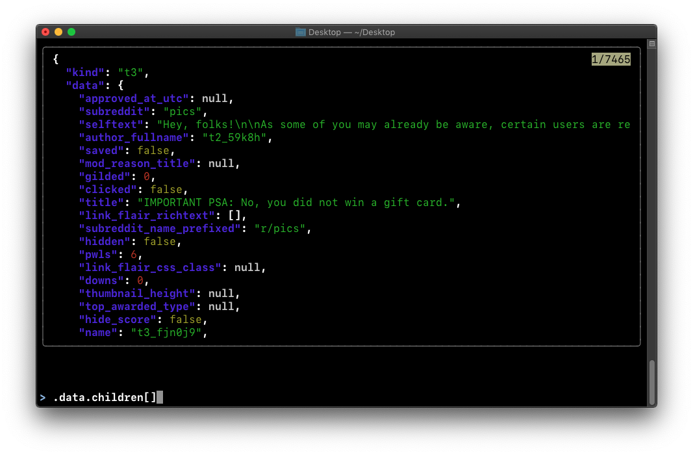

# dot-star

## Install

    mkdir -p ~/Projects
    cd ~/Projects
    git clone https://github.com/dot-star/dot-star.git
    cd dot-star
    ./install.sh

## Everyday aliases

### Git

| Example | Resolves to |
|---------|-------------|
| `cm "Some commit message"` | `git commit -m "Some commit message"` |
| `add file.txt` | `git add file.txt` |
| `co branch` | `git checkout branch` |
| `push` | `git push` |
| `nv "wip"` | `git commit --no-verify -m "wip"` |

### Search

| Example | Resolves to |
|---------|-------------|
| `s` (bare) | `git status` |
| `s "keyword"` | case-insensitive grep for `keyword` |
| `ss "Keyword"` | case-sensitive grep |
| `se "keyword"` | grep, then open matching files in vim |
| `f filter` | find files whose name contains `filter` |

### Diff

| Example | Resolves to |
|---------|-------------|
| `d` (in a git repo) | `git diff` |
| `d before.txt after.txt` | file diff |
| `d ps` (outside a git repo) | `docker ps` |

### Files / editing

| Example | Resolves to |
|---------|-------------|
| `v file.txt` | open `file.txt` in vim |
| `rp ./symlink` | resolve to absolute real path |
| `rm *` | refuses with a warning |

## Examples

### Prevent accidental wildcard deletion

    $ rm *
    cowardly refusing to run `rm' with a dangerous wildcard

### Watch a directory for changes using `wd` and run a test suite

    $ while :; do wd; phpunit MyTest.php; done

### Debug a jq filter

    $ jq api_response.json
    (opens an interactive fzf window for debugging a jq filter)



### View git stashes

    $ list
    (opens an interactive fzf stash preview window for viewing git stashes in the current repository)

### Apply a git stash

    $ pop
    (opens an interactive fzf stash preview window for selecting a git stash to apply)

### Diff strings

    $ diff_strings_like_files "foo" "foobar"
    
```diff
-foo
+foobar
```

### Rename file using one parameter

    $ mv download.jpg
    the-lorax.jpg
    -download.jpg
    +the-lorax.jpg

### List folders and files in current directory

    $ l

### List folders and files in a tree-like format (using the `tree' command)

    $ t

### Run a smarter git diff

    $ d

### Run a smarter file diff

    $ d before.txt after.txt

### Set clipboard

    $ pwd | clipboard
    $ pwd | clip
    $ cat file.txt | c

### Run `git add --patch'

    $ addp

### Change file permissions

    $ 644 myfile.txt

### Change folder permissions

    $ 400 ~/.ssh/id_rsa

### Go up one directory

    $ ..

### Go up two directories

    $ ...

### Go up more directories

    $ ....
    $ .....
    $ ......

### Backup a file or directory

    $ b script.py
    'script.py' -> 'script_2018-06-16_000000.py'

    $ b project/
    'project' -> 'project_2018-06-16_000000'
    'project/README.md' -> 'project_2018-06-16_000000/README.md'

### Search for files by file name

    $ f filter
    Searching paths and filenames containing "*filter*":
    ./admin/static/admin/js/SelectFilter2.js
    ./admin/templates/admin/filter.html
    ./admin/filters.py
    ./admindocs/templates/admin_doc/template_filter_index.html

### View git status

    $ s
    git status
    On branch master
    Your branch is up to date with 'origin/master'.

    nothing to commit, working tree clean

### View last git diff

    $ difflast

### View git log

    $ log

### List git stashes

    $ list
    stash@{0}: On master: work in progress

### Show a git stash

    $ show 0

### Run git pull

    $ pull

### Go up to the root git repository directory

    $ pwd
    /Users/user/.dot-star/vim/color
    $ r
    $ pwd
    /Users/user/.dot-star

### Open the current directory

    $ oo

### Search for files containing text

    $ s "admin.ModelAdmin"
    ./admin.py:26:class GroupAdmin(admin.ModelAdmin):
    ./admin.py:41:class UserAdmin(admin.ModelAdmin):

### Search for files containing text and edit

    $ se "admin.ModelAdmin"
    (file admin.py contains search keyword and is opened)

### Case-sensitive search for files containing text

    $ ss keyword

### Song duration added to `file' command

    $ file "Out of it All by Helen Jane Long.mp3"
    Out of it All by Helen Jane Long.mp3: Audio file with ID3 version 2.4.0, contains:MPEG ADTS, layer III, v2, 160 kbps, 22.05 kHz, Monaural (4,832,126 bytes)
    0:04:38

## Update

    $ dotstar
    $ ./update.sh

The installation and update may be run repeatedly. Neither action will remove nor overwrite files outside the dotstar directory.

## Compatibility
- Mac
- Ubuntu

## Mission

    There should be one-- and preferably only one --command to do it.
